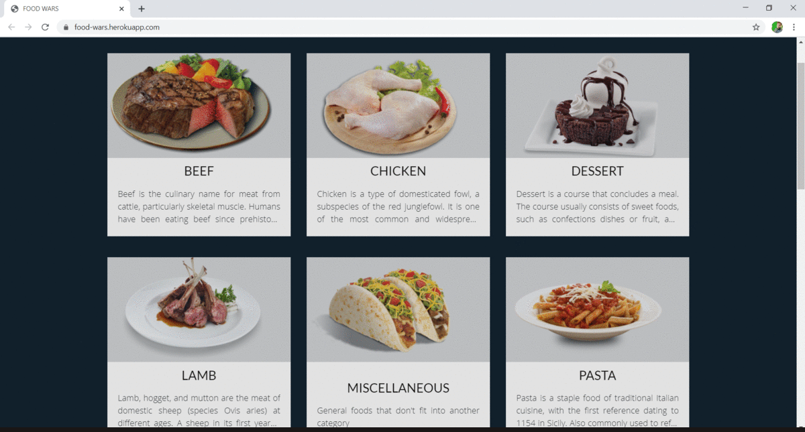

# REACT FOOD WAR

[![Contributors][contributors-shield]][contributors-url]
[![Forks][forks-shield]][forks-url]
[![Stargazers][stars-shield]][stars-url]
[![Issues][issues-shield]][issues-url]

The project is based on a catalogue of recipes which is build on React and Redux.



## Features
- Browse various categories of dishes
- Search for your favorite dishes based on the type of recipes.
- Get instructions on how to prepare your favorite recipe.

## Built With
- React
- ES6
- Redux
- Webpack
- SASS

## App Demo

[Live Demo](https://food-wars.herokuapp.com/)

## Setup

Use the [git](https://git-scm.com/downloads) to clone the project to your local machine.
```sh
$ git clone https://github.com/shubham14p3/react-recipes-catalogue.git
```

Navigate to the extracted folder
```sh 
cd meal-catalogue
```

Install the dependencies and modules
```sh
$ npm install
```

### Usage
```sh
$ npm start
```
This will open the app at port 3000. If it doesn't open, visit ```http://localhost:3000```

### Run Tests
```sh
$ npm test
```
## Author


👤 **Shubbham Raj**

- Website: [Shubham Raj](https://www.shubhamraj.dev/)
- Github: [@ShubhamRaj](https://github.com/shubham14p3)
- Linkedin: [Shubham14p3](https://www.linkedin.com/in/shubham14p3/)
- Email: shubham14p3@gmail.com


## 🤝 Contributing

Contributions, issues and feature requests are welcome!

## Show your support

Give a ⭐️ if you like this project!

## Acknowledgements
- [Microverse](https://www.microverse.org/)

## Future Enhancement

- Using authentication to login
- Creating users profile
- Coverting the website to an Online Resturant Store

## 📝 License

This project is licensed under MIT license - see [LICENSE](/LICENSE) for more details.


<!-- MARKDOWN LINKS & IMAGES -->

[contributors-shield]: https://img.shields.io/github/contributors/shubham14p3/react-recipes-catalogue.svg?style=flat-square
[contributors-url]: https://github.com/shubham14p3/react-recipes-catalogue/graphs/contributors
[forks-shield]: https://img.shields.io/github/forks/shubham14p3/react-recipes-catalogue.svg?style=flat-square
[forks-url]: https://github.com/shubham14p3/react-recipes-catalogue/network/members
[stars-shield]: https://img.shields.io/github/stars/shubham14p3/react-recipes-catalogue.svg?style=flat-square
[stars-url]: https://github.com/shubham14p3/react-recipes-catalogue/stargazers
[issues-shield]: https://img.shields.io/github/issues/shubham14p3/react-recipes-catalogue.svg?style=flat-square
[issues-url]: https://github.com/shubham14p3/react-recipes-catalogue/issues
